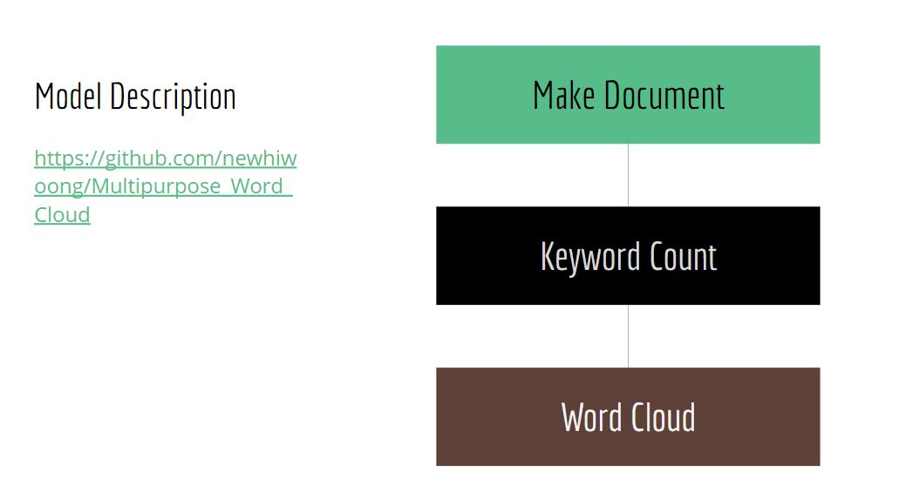
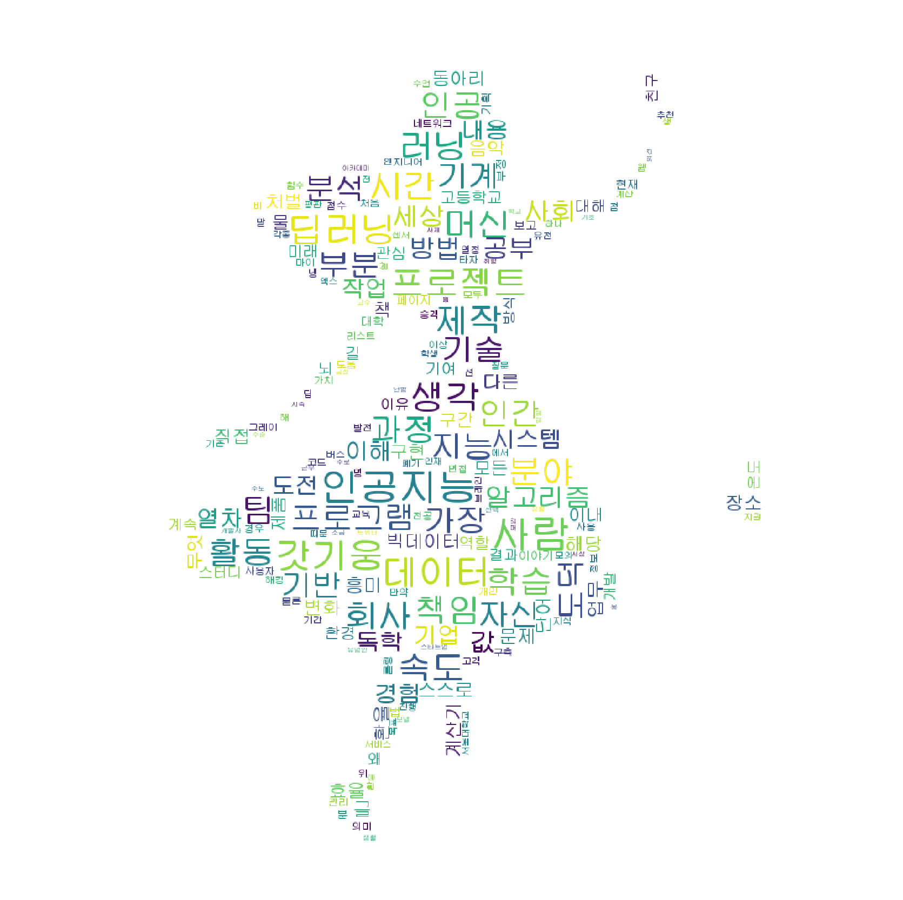

# Multipurpose_Word_Cloud

자기소개서 등을 한 눈에 볼 수 있는 방법이 없을까? 생각했습니다. 더 나아가서 자신이 원하는 글을 원하는 방식으로 표현하면 좋겠다는 생각으로 시작했습니다.

[카카오톡을 Word Cloud로 분석하기](https://newhiwoong.github.io/nlp/%EC%B9%B4%EC%B9%B4%EC%98%A4%ED%86%A1-%EB%8C%80%ED%99%94-%EB%82%B4%EC%9A%A9%EC%9D%84-Word-Cloud%EB%A1%9C-%EB%B6%84%EC%84%9D%ED%95%98%EA%B8%B0)

### 참고한 글
> https://amueller.github.io/word_cloud/auto_examples/index.html

## 설치
기본적으로 Git이 설치되있다고 가정하겠습니다. 워드클라우드를 진행할 코드를 저장할 하위 폴터에서 아래 코드를 실행시킵니다.

```
git init
git clone https://github.com/newhiwoong/National-Petition.git
```

## 👨‍💻 System requirements
기본적으로 ANACONDA 환경에 jupyter notebook에서 진행합니다. 이를 위해 [ANACONDA 설치](https://www.anaconda.com/download/) 및 환경 설정이 필수적으로 필요합니다. 그리고 이 Code는 Windows에서는 동작하지 않을 수 있습니다. 아래 링크를 참고하거나 명령어를 통해 필요한 것들을 설치합니다.

> https://www.java.com/ko/download/  
> https://konlpy-ko.readthedocs.io/ko/v0.4.3/install/  
> https://www.nltk.org/install.html  
> https://matplotlib.org/faq/installing_faq.html  
> https://anaconda.org/conda-forge/wordcloud  

### 👩‍💻 Dependency Build Instructions

#### Ubuntu User
```
sudo apt-get update
sudo apt-get install oracle-java8-installer
sudo apt-get install fonts-nanum-coding
```

#### All User
```
pip install nltk
pip install konlpy
pip install wordcloud
```


## How to use

  

위에 설치 작업을 완료했다고 가정하겠습니다.  

먼저 Word Cloud를 하고 싶은 글을 저장하고 keyword_count를 이용해서 Word Cloud에 필요한 준비를 합니다.  
``` python
data = keyword_count("my.txt")
```

글에 없지만 혹은 글에 있지만 더 크게 만들고 싶은 keyword를 아래와 같이 추가 합니다.  
``` python
tmp_data["인공지능"]=150
```

글 속에서 지우고 싶은 keyword를 아래와 같이 제거 합니다.  
``` python
del(data["개"])
```

이제 make_cloud 함수를 이용해서 프로그램을 출력합니다.  
``` python
def make_cloud(tmp_data, back_image_n,state="no", font_n = "UnDinaru.ttf",background_color_n='white', max_font_size_n = 40):

back_image_n = "image 폴더에 있는 사진 중 Word Cloud의 모습이 되길 바라는 사진"
state = "Word Cloud의 표현되는 색"
       "no"         #랜덤하게 출력합니다.
       "grey"       #회색으로 출력합니다.
       "img"        #back_image_n 이미지의 색에 맞춰 출력합니다.
       (116,1,113)  #원하는 RGP로 표현합니다.
font_n = "Word Cloud에 적용할 폰트 이름"
background_color_n = "배경으로 바라는 색"
max_font_size_n = "Word Cloud에 표시할 글씨의 최대 크기"
```

하나의 예시 입니다.   
``` python
make_cloud(data,back_image_n="skeleton_king.jpg" ,state="grey", background_color_n='black', max_font_size_n = 50, font_n="malgun.ttf")
``` 
 

## example
<b>이 프로그램을 이용해 만든 자기소개서 Word Cloud 예시입니다.</b>
  
  
  
  
  

  

## Next
  
